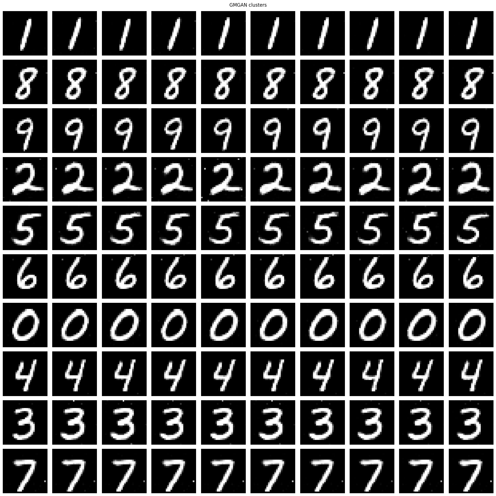
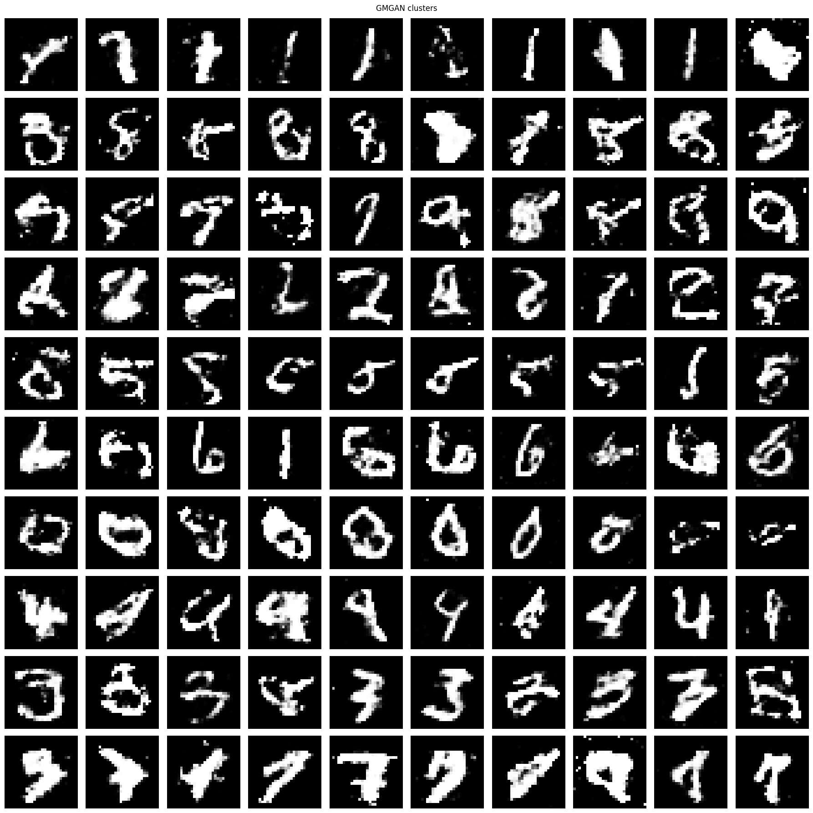
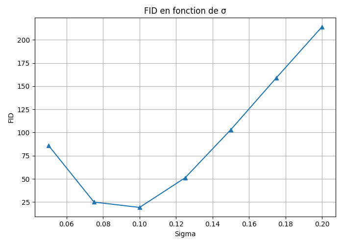
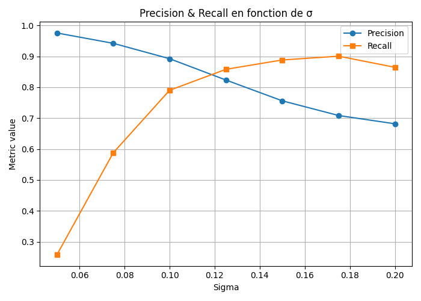

# GMGAN-MNIST: Gaussian Mixture GAN for Precision–Recall Control

This project implements a Gaussian Mixture Generative Adversarial Network (GMGAN) using PyTorch to study how a structured latent space can improve the precision–recall trade-off in GANs. 

## Project Structure

```
ASSIGNMENT2-2025-DSL/
├── checkpoints/
│   └── G.pth
├── gaussian_mixture/
│   ├── config.yaml
│   ├── generate.py
│   ├── metrics.py
│   ├── model.py
│   ├── train.py
│   └── trainer.py
├── notebooks/
│   ├── test.ipynb
│   └── vizualisation.ipynb
├── generate.py
├── model.py
├── train.py
├── utils.py
└── requirements.txt
````

## Key Features

- GMGAN generator and discriminator based on the original GAN objective
- Learnable Gaussian cluster centers in the latent space
- Fixed isotropic covariance for controlled dispersion
- Training regularization (dropout + Gaussian noise in discriminator)
- Precision, recall, and FID evaluation on MNIST feature embeddings


## Result Summary

GANs often struggle to balance sample quality (precision) and diversity (recall). GMGAN introduces an explicit structure in the latent space by sampling from a mixture of K Gaussian components. 

$$ z \sim \sum_{k=1}^{K} \pi_k \, \mathcal{N}(\mu_k, \Sigma_k) $$

- The number of clusters $K$
- The covariance $\sigma^2 I$  is fixed and shared across all clusters
- The means $\mu_k$ are learnable

This multimodal structure encourages the generator to map each latent cluster to a specific semantic mode of the MNIST dataset, reducing mode collapse while preserving sample diversity.

Below are the generated samples and evaluation curves obtained for different values of the latent Gaussian variance $\sigma$.

<table align="center">
  <tr>
    <td align="center">
      <br>
      <em>σ = 0.01</em>
    </td>
    <td align="center">
      <br>
      <em>σ = 0.1</em>
    </td>
    <td align="center">
      <br>
      <em>σ = 0.2</em>
    </td>
  </tr>
</table>

<small>
σ = 0.01 produces very compact clusters, which increases precision but reduces diversity, as the model fails to cover the full variability of each digit.  
σ = 0.1 offers the best balance: clusters remain well separated while still capturing intra-class variation.  
σ = 0.2 yields broader clusters, increasing diversity but reducing sharpness and leading to partial overlap between digit classes.
</small>

<br>


<table align="center">
  <tr>
    <td align="center">
      <br>
      <em>FID vs σ</em>
    </td>
    <td align="center">
      <br>
      <em>Precision–Recall vs σ</em>
    </td>
  </tr>
</table>

<small>
The FID curve shows a clear optimum at σ = 0.1, matching the qualitative inspection of generated samples.  
The precision–recall curves highlight the expected trade-off: smaller σ values improve precision, larger σ values improve recall, and σ = 0.1 again provides the most stable compromise.
</small>

## Installation

```bash
python -m venv .venv
source .venv/bin/activate
pip install --upgrade pip
pip install -r requirements.txt
```

## Environment Variables Setup

Create a file named `.env` and add the following lines:
```
DATA_PATH=/Your/path/to/data/MNIST/
CHECKPOINTS_PATH=/Your/path/to/a/checkpoint/folder/
CONFIG_PATH=/Your/path/to/config.yaml
```